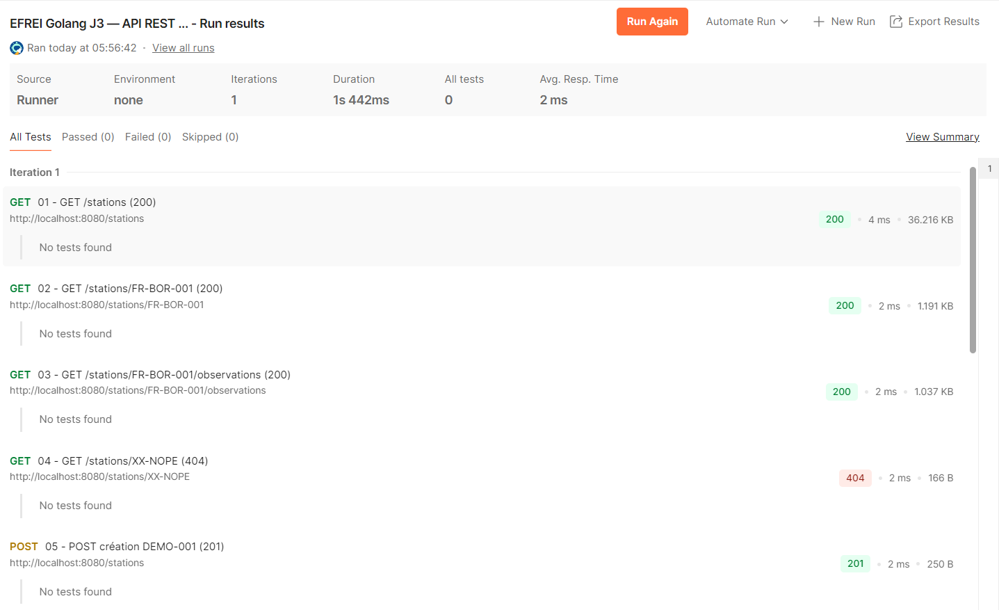
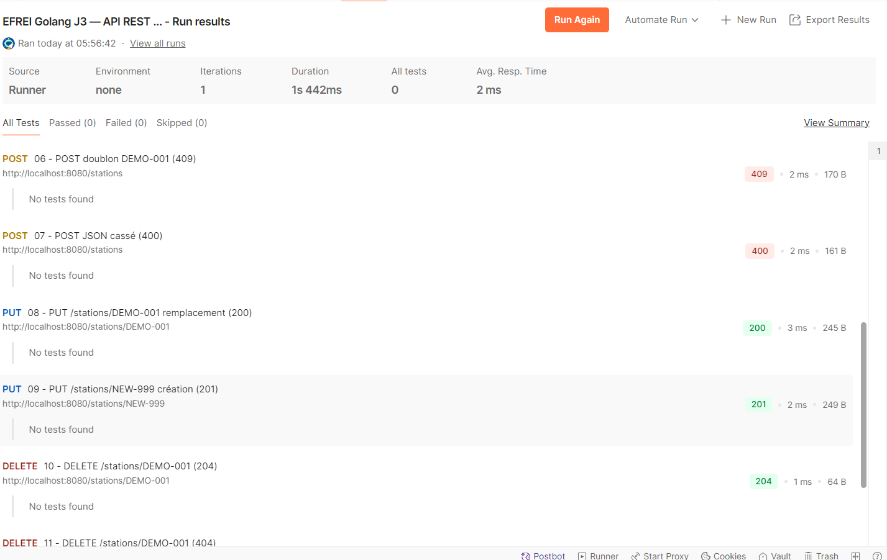

# Atelier Météo — Parsing JSON / XML en Go

## Partie A — Comparaison des schémas de données

Avant de modéliser les données en Go, voici l'analyse des deux formats sources :

| Donnée                   | Comment c'est représenté en JSON ?                                                      | Comment c'est représenté en XML ?                                                                             |
|:-------------------------|:----------------------------------------------------------------------------------------|:--------------------------------------------------------------------------------------------------------------|
| **Pays**                 | Champ `country` en String à la racine de la station.                                    | Code ISO à 2 lettres dans l'attribut `country` de la station.                                                 |
| **Coordonnées**          | Objet imbriqué `location` contenant les champs `longitude` et `latitude` en float.      | Attributs `lat` et `lon` sur l'élément enfant `<coordinates>` dans l'element parent Station.                  |
| **Altitude**             | Champ `altitude_m` en int.                                                              | Attribut `altitude` situé sur l'élément enfant `<coordinates>`dans l'element parent Station.                  |
| **Modèle de capteur**    | Objet imbriqué `device` avec `type`, `manufacturer` et `installed_on` (tous en String). | Attributs `vendor`, `model`, et `since` sur l'élément enfant `<hardware>`, parent station.                    |
| **Température**          | Champ `temperature_celsius` en float dans l'observation.                                | Contenu textuel (chardata) d'un élément `<measure>` possédant l'attribut `type="temperature"`.                |
| **Conditions ciel**      | Champ `conditions` en String dans l'observation.                                        | Attribut `sky` placé directement sur l'élément `<observation>` parent station.                                |
| **Vent**                 | Objet `wind` imbriqué avec `speed_kmh` (float) et `direction_deg` (int).                | Attributs `speed` et `direction` sur l'élément enfant `<wind>` parent station.                                |
| **Notes (optionnelles)** | Champ `notes` en String dans l'observation (peut être `null`).                          | Élément `<note>` qui contient le texte, mais qui est totalement omis s'il n'y a pas de note. Dasn observation |

# API REST Météo 

Ce projet implémente une API REST en Go  permettant de gérer et consulter des données de stations météorologiques.

##  Comment lancer le serveur

Pour démarrer l'API, placez-vous à la racine du projet et exécutez :
\`\`\`bash
go run .
\`\`\`
Le serveur démarrera sur le port 8080 : \`http://localhost:8080\`

## Les routes de l'API et statuts attendus

1. **\`GET /health\`** : Vérifie l'état du serveur (**200 OK**)
2. **\`GET /stations\`** : Liste toutes les stations (**200 OK**)
3. **\`GET /stations/{id}\`** : Récupère une station spécifique (**200 OK**, **404 Not Found**)
4. **\`POST /stations\`** : Crée une nouvelle station (**201 Created**, **400 Bad Request**, **409 Conflict**)
5. **\`PUT /stations/{id}\`** : Met à jour ou crée une station (**200 OK**, **201 Created**)
6. **\`DELETE /stations/{id}\`** : Supprime une station (**204 No Content**, **404 Not Found**)
7. **\`GET /stations/{id}/observations\`** : Liste les observations d'une station (**200 OK**, **404 Not Found**)

*(Toutes les erreurs sont renvoyées sous un format JSON normalisé avec un code interne).*

## Tests et Validation

Les tests de validation ont été effectués à l'aide de la collection Postman fournie pour le TP : EFREI Golang J3 — API REST météo.

### Résultat du Runner Postman  :

